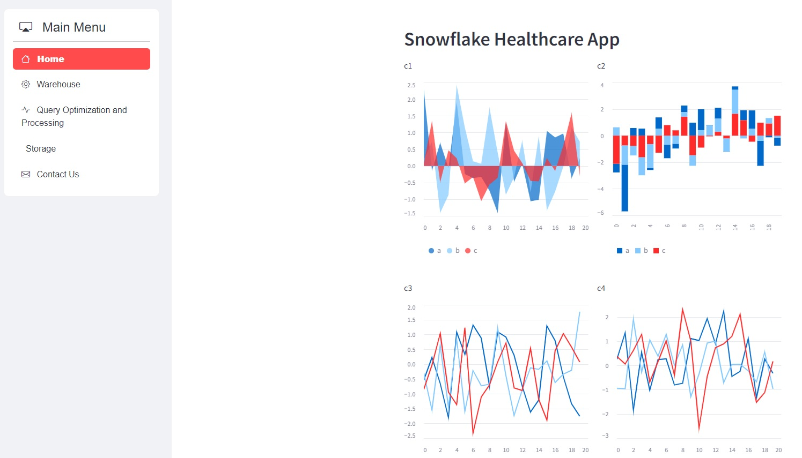

# PROHI Dashboard Example

# [Name of the project]

_You can modify this README file with all the information that your team consider relevant for a technical audience who would like to understand your project or to run it in the future._

_Note that this file is written in **MarkDown** language. A reference is available here: <https://www.markdownguide.org/basic-syntax/>_

Include the name, logo and images refering to your project



## Introduction

[Project ] is an interactive web dashboard to.... 

The problem detected was...

The proposed solution is valuable because...

## System description

### Dependencies

Tested on Python 3.10 with the following packages:
  - Jupyter v1.1.1
  - Streamlit v1.38.0
  - Seaborn v0.13.2
  - Plotly v5.24.0
  - Scikit-Learn v1.5.1
  - shap v0.46.0

### Installation

Run the commands below in a terminal to configure the project and install the package dependencies for the first time.

If you are using Mac, you may need to follow install Xcode. Check the official Streamlit documentation [here](https://docs.streamlit.io/get-started/installation/command-line#prerequisites). 

1. Create the environment with `python -m venv env`
2. Activate the virtual environment for Python
   - `source env/bin/activate` [in Linux/Mac]
   - `.\env\Scripts\activate.bat` [in Windows command prompt]
   - `.\env\Scripts\Activate.ps1` [in Windows PowerShell]
3. Make sure that your terminal is in the environment (`env`) not in the global Python installation
4. Install required packages `pip install -r ./requirements.txt`
5. Check that everything is ok running `streamlit hello`

### Execution

To run the dashboard execute the following command:

```
> streamlit run Dashboard.py
# If the command above fails, use:
> python -m streamlit run Dashboard.py
```

## Contributors

_Add the project's authors, contact information, and links to their websites or portfolios._